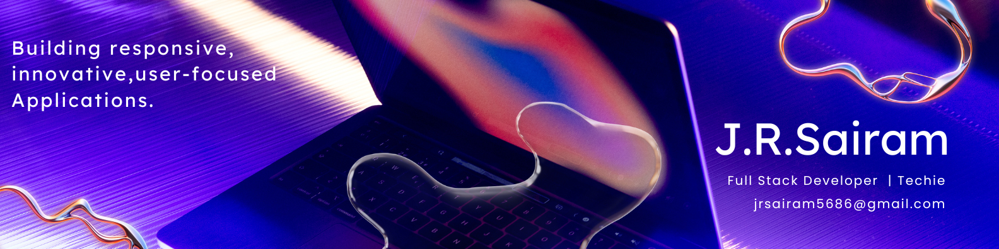

  

<h1 align="center">Hi 👋, I'm J.R. Sairam</h1>
<h3 align="center">A passionate Full Stack Developer from India</h3>

  

 

- 🔭 I'm currently working on **Reactify** - An AI-driven code generator

- 🌱 I'm currently learning **TypeScript and DSA **

- 👨‍💻 All of my projects are available at [Portfolio](https://jrsairam.framer.website/)

- 🎓 Pursuing Bachelor of Engineering in Computer Science at **Rajalakshmi Institute of Technology**

- 📫 How to reach me: **jrsairam5686@gmail.com**

<h3 align="left">Connect with me:</h3>

  
  
  
  

<h3 align="left">🏆 Achievements:</h3>

  • 2nd Prize Winner - IIT PALS Innowah Challenge at IIT Madras (August 2023) 
  • Recognition in Lab-to-Market Competition at IIT Madras (October 2023)

<h3 align="left">💼 Experience:</h3>

  <b>Full Stack Developer Intern</b> at Derelle Consulting Private Limited (October - November 2024) 
  • Built a platform to visualize electricity distribution across 12 districts in Tamil Nadu 
  • Developed with React.js frontend and Node.js/Express.js backend

<h3 align="left">🚀 Featured Projects:</h3>

  <b>Reactify | AI-Driven Code Generator</b> 
  A tool that simplifies full-stack and React application development using TypeScript and Web Containers.  
  
  <b>Personal Portfolio Website</b> 
  A dynamic portfolio built with React, Framer Motion, and Tailwind CSS.  
  
  <b>Multiple Disease Analyzer</b> 
  A Python-based ML application that predicts multiple diseases through a Streamlit interface.

<h3 align="left">Languages:</h3>

  
  
  
  
  
  
  
  

<h3 align="left">Frameworks & Libraries:</h3>

  
  
  
  
  
  
  

<h3 align="left">Tools & Technologies:</h3>

  
  
  
  
  
  

<h3 align="left">📊 GitHub Stats:</h3>

  

  

<h3 align="center">💬 Let's connect and build something amazing together! 🚀</h3>
